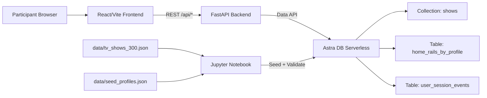
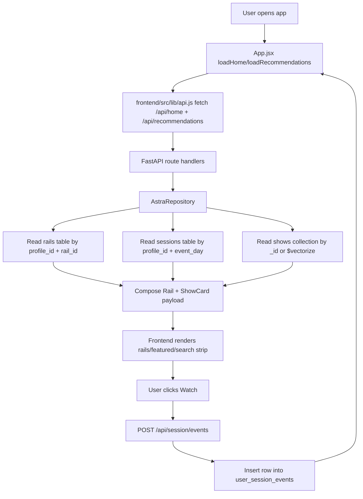
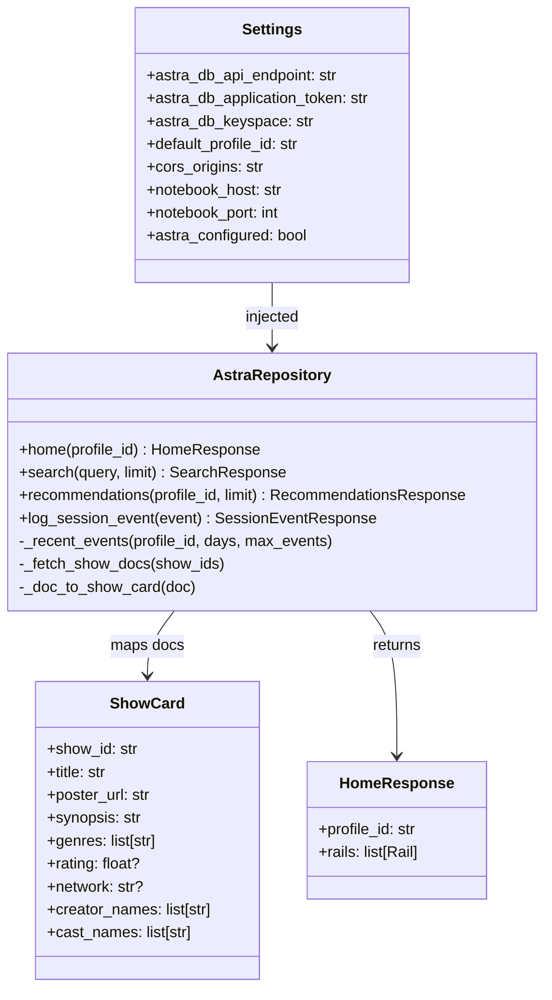
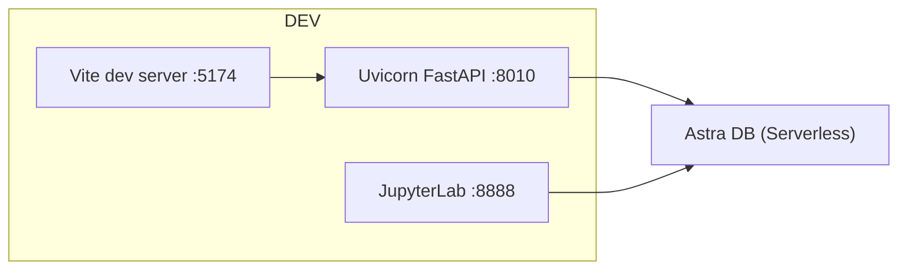
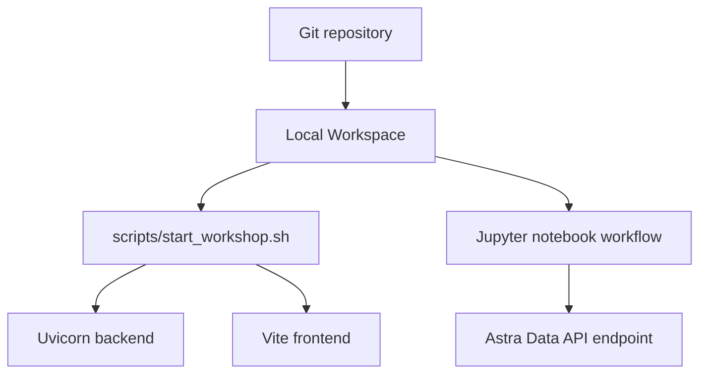

# StreamFlix Technical Onboarding Guide

Project: **astradb_handson_tvshow / StreamFlix Astra DB Workshop**  
Generated on: **2026-03-21**

This document is a developer onboarding map for the current workspace codebase.

---

## 1. README / Instruction Files Summary

### 1.1 Primary docs found
- [README.md](README.md)
- [QUICKSTART.md](QUICKSTART.md)
- [WORKSHOP.md](WORKSHOP.md)
- [.env.example](.env.example)
- [.devcontainer/devcontainer.json](.devcontainer/devcontainer.json)

No `CONTRIBUTING.md`/`LEIAME.md` was found.

### 1.2 Key points for new developers

#### Project overview
- The app is a **Netflix-inspired workshop demo** for Astra DB, combining:
  - vector search (Astra collection)
  - personalized rails (Astra tables)
  - session event writes and continue-watching behavior
- See [README.md](README.md#streamflix-astra-db-workshop).

#### Local setup and run
- Quick flow is documented in [QUICKSTART.md](QUICKSTART.md):
  1. Copy and edit `.env`
  2. Install Python + Node dependencies
  3. Launch notebook and run ingestion cells
  4. Start backend+frontend via [`scripts/start_workshop.sh`](scripts/start_workshop.sh)

#### Standards and conventions visible in code
- Backend: FastAPI + Pydantic response/request models and repository abstraction.
- Frontend: React function components with state hooks, modular components in `src/components`.
- Data contract consistency through `ShowCard` shape in backend model and frontend renderers.

#### Contribution guidance
- No explicit contribution guide file exists.
- Practical conventions inferred from code and docs:
  - keep workshop deterministic by reseeding tables/collection in notebook ([notebook/streamflix_astra_workshop.ipynb](notebook/streamflix_astra_workshop.ipynb))
  - use `.env` for runtime config ([.env.example](.env.example))
  - keep startup simple through [`scripts/start_workshop.sh`](scripts/start_workshop.sh)

---

## 2. Detailed Technology Stack

| Area | Technology | Evidence |
|---|---|---|
| Backend language | Python 3.11+ (devcontainer image) | [.devcontainer/devcontainer.json](.devcontainer/devcontainer.json#L3) |
| Backend framework | FastAPI | [backend/requirements.txt](backend/requirements.txt#L1), [backend/app/main.py](backend/app/main.py#L15) |
| API server | Uvicorn | [backend/requirements.txt](backend/requirements.txt#L2), [scripts/start_workshop.sh](scripts/start_workshop.sh#L29) |
| Data access SDK | `astrapy` (Astra Data API client) | [backend/requirements.txt](backend/requirements.txt#L3), [backend/app/repository.py](backend/app/repository.py#L9) |
| Validation/modeling | Pydantic v2 | [backend/requirements.txt](backend/requirements.txt#L5), [backend/app/models.py](backend/app/models.py#L3) |
| Frontend language | JavaScript (ES modules) | [frontend/package.json](frontend/package.json#L5) |
| Frontend framework | React 18 | [frontend/package.json](frontend/package.json#L13), [frontend/src/App.jsx](frontend/src/App.jsx) |
| Frontend build tool | Vite | [frontend/package.json](frontend/package.json#L7), [frontend/vite.config.js](frontend/vite.config.js) |
| Database | Astra DB Serverless (NoSQL) | [README.md](README.md#architecture), [backend/app/repository.py](backend/app/repository.py#L41) |
| NoSQL model style | **Collection + Tables hybrid** | [notebook/streamflix_astra_workshop.ipynb](notebook/streamflix_astra_workshop.ipynb) (cells creating `shows`, `home_rails_by_profile`, `user_session_events`) |
| Vector search | Astra collection `sort={"$vectorize": ...}` | [backend/app/repository.py](backend/app/repository.py#L77), [backend/app/repository.py](backend/app/repository.py#L113) |
| Notebook tooling | JupyterLab | [QUICKSTART.md](QUICKSTART.md#3-run-notebook-ingestion-important-env-loading-step), [backend/app/main.py](backend/app/main.py#L302) |
| Test frameworks | Pytest, FastAPI TestClient, Playwright | [backend/requirements.txt](backend/requirements.txt#L6), [backend/tests/test_app.py](backend/tests/test_app.py), [frontend/package.json](frontend/package.json#L17) |
| Package managers | `pip`, `npm` | [QUICKSTART.md](QUICKSTART.md#2-install-dependencies) |
| Cloud/Provider integration | DataStax Astra DB, TVMaze API, optional TMDB API | [README.md](README.md#attribution), [scripts/fetch_tvmaze_snapshot.py](scripts/fetch_tvmaze_snapshot.py#L17) |
| Container/dev env | Dev Containers / Codespaces-friendly | [.devcontainer/devcontainer.json](.devcontainer/devcontainer.json) |

### Architecture style
- Practical architecture is a **single-workspace, multi-component monolith**:
  - React frontend
  - FastAPI backend
  - Astra data layer
  - notebook/script ingestion tools
- Backend follows light **API + Repository + Model** separation.

---

## 3. System Overview and Purpose

### 3.1 What the system does
StreamFlix is a guided workshop system teaching Astra DB capabilities in ~60 minutes. Participants:
1. provision Astra DB
2. ingest seeded TV data via notebook
3. run a Netflix-like UI to explore rails, semantic search, and session updates

### 3.2 Intended users
- Workshop attendees learning Astra DB tables/collections/vector search
- Instructors running an interactive hands-on lab
- Maintainers refreshing seed datasets

### 3.3 Problem solved
- Demonstrates **combined NoSQL patterns** in one app:
  - denormalized table reads for homepage rails/session history
  - semantic retrieval via vectorized collection

### 3.4 Core functionalities
- Homepage rails per profile ([`GET /api/home`](backend/app/main.py#L85))
- Semantic show search ([`GET /api/search`](backend/app/main.py#L94))
- Recommendations from recent watch context ([`GET /api/recommendations`](backend/app/main.py#L103))
- Session event ingestion for continue-watching ([`POST /api/session/events`](backend/app/main.py#L112))
- Admin helper to open workshop notebook ([`POST /api/admin/notebook`](backend/app/main.py#L75))

---

## 4. Project Structure and Reading Recommendations

### 4.1 Entry points
- Backend app entry: [backend/app/main.py](backend/app/main.py)
- Frontend app entry: [frontend/src/main.jsx](frontend/src/main.jsx)
- Frontend root component: [frontend/src/App.jsx](frontend/src/App.jsx)
- Local orchestrator script: [scripts/start_workshop.sh](scripts/start_workshop.sh)
- Data ingestion notebook: [notebook/streamflix_astra_workshop.ipynb](notebook/streamflix_astra_workshop.ipynb)

### 4.2 Folder organization
- `backend/`
  - `app/` API routes, settings, repository, Pydantic models
  - `tests/` backend API contract tests
- `frontend/`
  - `src/` React app, API client, components, styles
  - `tests/e2e/` Playwright smoke tests
- `data/` prebuilt dataset and seed rows
- `notebook/` workshop ingestion notebook
- `scripts/` snapshot generation, seed generation, local startup script

### 4.3 Critical configuration files
- Runtime env template: [.env.example](.env.example)
- Backend dependencies: [backend/requirements.txt](backend/requirements.txt)
- Frontend dependencies/scripts: [frontend/package.json](frontend/package.json)
- Devcontainer: [.devcontainer/devcontainer.json](.devcontainer/devcontainer.json)

### 4.4 Recommended reading order
1. [README.md](README.md)
2. [QUICKSTART.md](QUICKSTART.md)
3. [backend/app/main.py](backend/app/main.py)
4. [backend/app/repository.py](backend/app/repository.py)
5. [backend/app/models.py](backend/app/models.py)
6. [frontend/src/lib/api.js](frontend/src/lib/api.js)
7. [frontend/src/App.jsx](frontend/src/App.jsx)
8. [frontend/src/components/SearchPanel.jsx](frontend/src/components/SearchPanel.jsx)
9. [notebook/streamflix_astra_workshop.ipynb](notebook/streamflix_astra_workshop.ipynb)
10. [scripts/fetch_tvmaze_snapshot.py](scripts/fetch_tvmaze_snapshot.py) and [scripts/generate_seed_profiles.py](scripts/generate_seed_profiles.py)

---

## 5. Key Components

### 5.1 API Layer (FastAPI routes)
- File: [backend/app/main.py](backend/app/main.py)
- Responsibilities:
  - expose workshop HTTP endpoints
  - dependency injection for repository/settings
  - map Astra exceptions to HTTP responses
  - notebook launcher orchestration

Representative snippet:
```python
@app.get("/api/search", response_model=SearchResponse)
def get_search(
    q: str = Query(min_length=2),
    repo: AstraRepository = Depends(get_repository),
) -> SearchResponse:
    _ensure_configured(repo)
    return repo.search(q)
```
Source: [backend/app/main.py#L94](backend/app/main.py#L94)

### 5.2 Repository Layer (Astra data access + business shaping)
- File: [backend/app/repository.py](backend/app/repository.py)
- Responsibilities:
  - table + collection queries
  - homepage rail assembly
  - recommendation basis generation
  - session event writes

Representative snippet:
```python
cursor = self._shows_collection().find(
    {},
    sort={"$vectorize": query},
    include_similarity=True,
    limit=limit,
)
cards = [self._doc_to_show_card(doc) for doc in cursor]
```
Source: [backend/app/repository.py#L77](backend/app/repository.py#L77)

### 5.3 Domain/Data models (Pydantic)
- File: [backend/app/models.py](backend/app/models.py)
- Responsibilities:
  - define response contracts and shared `ShowCard` schema
  - validate incoming session event payload shape

Representative snippet:
```python
class ShowCard(BaseModel):
    show_id: str
    title: str
    poster_url: str
    synopsis: str
    genres: list[str] = Field(default_factory=list)
    ...
```
Source: [backend/app/models.py#L6](backend/app/models.py#L6)

### 5.4 Frontend container and state orchestration
- File: [frontend/src/App.jsx](frontend/src/App.jsx)
- Responsibilities:
  - load home and recommendations
  - debounce semantic search
  - post watch/session events
  - admin dropdown actions

Representative snippet:
```jsx
useEffect(() => {
  const timeout = setTimeout(async () => {
    if (!query.trim()) {
      setSearchResults([]);
      setSelectedSearchItem(null);
      return;
    }
    const payload = await searchShows(query.trim());
    const nextResults = payload.results || [];
    setSearchResults(nextResults);
    setSelectedSearchItem(nextResults[0] || null);
  }, 320);

  return () => clearTimeout(timeout);
}, [query]);
```
Source: [frontend/src/App.jsx#L57](frontend/src/App.jsx#L57)

### 5.5 Search presentation component
- File: [frontend/src/components/SearchPanel.jsx](frontend/src/components/SearchPanel.jsx)
- Responsibilities:
  - featured selected item detail view
  - metadata chips and credit rendering
  - click-select strip cards

Representative snippet:
```jsx
{query && results.length ? (
  <div className="search-result-strip">
    {results.map((item) => (
      <button
        className={`search-strip-card${featured?.show_id === item.show_id ? ' is-active' : ''}`}
        key={item.show_id}
        onClick={() => onSelect(item)}
      >
```
Source: [frontend/src/components/SearchPanel.jsx#L84](frontend/src/components/SearchPanel.jsx#L84)

### 5.6 Notebook ingestion workflow
- File: [notebook/streamflix_astra_workshop.ipynb](notebook/streamflix_astra_workshop.ipynb)
- Responsibilities:
  - connect to Astra via env vars
  - create collection/tables
  - insert snapshot docs and seed rows
  - validate semantic query and partition reads

Key cell themes:
- Create collection `shows` with vector service
- Create tables `user_session_events` and `home_rails_by_profile`
- Insert `data/tv_shows_300.json` and `data/seed_profiles.json`

### 5.7 Data maintenance scripts
- [scripts/fetch_tvmaze_snapshot.py](scripts/fetch_tvmaze_snapshot.py): fetch/enrich 300-show snapshot from TVMaze + optional TMDB.
- [scripts/generate_seed_profiles.py](scripts/generate_seed_profiles.py): generate profile rails and session events.

---

## 6. Execution and Data Flows

### 6.1 Runtime flow (normal user path)
1. Browser loads React app ([frontend/src/main.jsx](frontend/src/main.jsx)).
2. `App` fetches home and recommendations through API client ([frontend/src/lib/api.js](frontend/src/lib/api.js)).
3. FastAPI routes call repository methods:
   - home: [backend/app/repository.py#L57](backend/app/repository.py#L57)
   - recommendations: [backend/app/repository.py#L86](backend/app/repository.py#L86)
   - search: [backend/app/repository.py#L76](backend/app/repository.py#L76)
4. Repository queries Astra Data API collection/tables and maps docs to `ShowCard`.
5. Frontend renders rails and search details.
6. User clicks watch -> `POST /api/session/events` -> session table insert -> app reloads rails/recommendations.

### 6.2 Ingestion flow (workshop prep/runtime)
1. Notebook reads env vars and connects to Astra.
2. Notebook creates schema (`shows` collection + 2 tables).
3. Notebook loads local data snapshots.
4. Notebook validates counts + semantic query sample.

### 6.3 Data persistence/read model
- Persisted in Astra:
  - Collection `shows`: rich show docs + vector text
  - Table `home_rails_by_profile`: profile+rail+rank -> show ordering
  - Table `user_session_events`: profile+day+time -> behavior events
- Backend reads tables for deterministic rails, then hydrates show docs from collection by show IDs.

### 6.4 Database schema overview

#### Collection: `shows` (NoSQL document + vector)
Main fields observed in snapshot ([data/tv_shows_300.json](data/tv_shows_300.json)):
- `_id`, `title`, `genres`, `year`, `synopsis`, `poster_url`, `rating`, `row_tags`
- metadata enrichment: `network`, `runtime`, `language`, `status`, `premiered_date`, `tags`, `creator_names`, `director_names`, `cast_names`
- vector text: `vectorize_text` (inserted as `$vectorize` in notebook)

#### Table: `user_session_events`
Defined in notebook with partition and clustering:
- Partition keys: `profile_id`, `event_day`
- Sort keys: `event_ts DESC`, `event_id ASC`
- Payload: show and playback state

#### Table: `home_rails_by_profile`
Defined in notebook:
- Partition keys: `profile_id`, `rail_id`
- Sort key: `rank ASC`
- Payload: `show_id`, `reason`

Relationships are application-level:
- `home_rails_by_profile.show_id` and `user_session_events.show_id` reference `shows._id`.

---

## 7. Dependencies and Integrations

### 7.1 Main dependencies

#### Backend deps
- `fastapi`: API framework ([backend/requirements.txt](backend/requirements.txt#L1))
- `uvicorn[standard]`: ASGI serving ([backend/requirements.txt](backend/requirements.txt#L2))
- `astrapy`: Astra Data API client ([backend/requirements.txt](backend/requirements.txt#L3))
- `pydantic`: schema validation ([backend/requirements.txt](backend/requirements.txt#L5))
- `pytest`/`httpx`: backend testing ([backend/requirements.txt](backend/requirements.txt#L6))

#### Frontend deps
- `react`, `react-dom` ([frontend/package.json](frontend/package.json#L13))
- `vite`, `@vitejs/plugin-react` ([frontend/package.json](frontend/package.json#L18))
- `@playwright/test` for E2E smoke tests ([frontend/package.json](frontend/package.json#L17))

### 7.2 External integrations
- **Astra DB Serverless Data API**
  - connection in backend repository ([backend/app/repository.py#L41](backend/app/repository.py#L41))
  - notebook data loading ([notebook/streamflix_astra_workshop.ipynb](notebook/streamflix_astra_workshop.ipynb))
- **TVMaze API** (data generation only)
  - [scripts/fetch_tvmaze_snapshot.py#L17](scripts/fetch_tvmaze_snapshot.py#L17)
- **TMDB API** optional enrichment for maintainers
  - env keys in [.env.example](.env.example#L11)
  - request logic in [scripts/fetch_tvmaze_snapshot.py#L171](scripts/fetch_tvmaze_snapshot.py#L171)

### 7.3 API documentation availability
- No static Swagger file checked into repo.
- Because backend uses FastAPI app declaration ([backend/app/main.py#L36](backend/app/main.py#L36)), OpenAPI docs are typically available at runtime:
  - `/docs` (Swagger UI)
  - `/openapi.json`

---

## 8. Diagrams (Mermaid)

### 8.1 Component diagram


### 8.2 Data flow diagram


### 8.3 Class/structure diagram (backend core)


### 8.4 Simplified deployment diagram


### 8.5 Simplified infrastructure/deployment view


---

## 9. Testing

### 9.1 What tests exist
- Backend unit/contract tests:
  - [backend/tests/test_app.py](backend/tests/test_app.py)
- Frontend E2E smoke tests:
  - [frontend/tests/e2e/smoke.spec.js](frontend/tests/e2e/smoke.spec.js)

### 9.2 Frameworks
- Backend: `pytest`, `fastapi.testclient`
- Frontend: Playwright

### 9.3 Typical execution
- Backend:
```bash
cd backend
python3 -m pytest -q
```
- Frontend E2E:
```bash
cd frontend
npm run test:e2e
```

### 9.4 CI/CD evidence
- No `.github/workflows/` or other CI config files were found in tracked files.
- Current test execution appears manual/local.

---

## 10. Error Handling and Logging

### 10.1 Backend error handling patterns
- Global-ish exception mapping for Astra Data API errors:
  - [handle_data_api_error](backend/app/main.py#L50)
- Guard for missing Astra credentials:
  - [_ensure_configured](backend/app/main.py#L122)
- Notebook launcher returns HTTP 503 with actionable messages on failures:
  - [_ensure_notebook_server](backend/app/main.py#L274)

### 10.2 Frontend error handling patterns
- API helper parses non-2xx responses and throws meaningful messages:
  - [frontend/src/lib/api.js#L4](frontend/src/lib/api.js#L4)
- Top-level app stores error state and shows toast/banner:
  - [frontend/src/App.jsx#L21](frontend/src/App.jsx#L21), [frontend/src/App.jsx#L175](frontend/src/App.jsx#L175)

### 10.3 Logging
- No structured logging library found (`logging`, Winston, etc.).
- Backend mostly uses exception responses; scripts use `print` for progress.
- Frontend uses occasional `console.error` ([frontend/src/App.jsx#L48](frontend/src/App.jsx#L48)).

### 10.4 Monitoring/observability
- No Sentry/Datadog/OpenTelemetry integration visible in tracked files.

---

## 11. Security Considerations

### 11.1 Visible mechanisms
- Secrets externalized through env vars:
  - Astra endpoint/token in [.env.example](.env.example#L2)
- CORS configuration controlled by env and applied middleware:
  - [backend/app/config.py#L38](backend/app/config.py#L38)
  - [backend/app/main.py#L41](backend/app/main.py#L41)
- Backend keeps Astra token server-side (frontend never directly calls Astra).

### 11.2 Gaps to note for a new developer
- No authentication/authorization for API endpoints.
- Admin notebook launcher endpoint is public within app context.
- Jupyter launcher command currently sets empty token/password by default:
  - [backend/app/main.py#L305](backend/app/main.py#L305)

### 11.3 Input validation
- Pydantic is used for request/response shape, but business constraints are minimal in `SessionEventRequest`:
  - [backend/app/models.py#L50](backend/app/models.py#L50)

### 11.4 Secrets management
- `.env` usage is straightforward; `.env` is gitignored ([.gitignore](.gitignore#L7)).
- No vault/KMS integration visible.

---

## 12. Other Relevant Observations (Including Build/Deploy)

### 12.1 Build/deploy artifacts present
- Devcontainer setup for reproducible workshop environment:
  - [.devcontainer/devcontainer.json](.devcontainer/devcontainer.json)
- Startup orchestration script for local dev:
  - [scripts/start_workshop.sh](scripts/start_workshop.sh)
- No Dockerfile / docker-compose / Kubernetes manifests in tracked files.

### 12.2 Practical onboarding notes
- The workshop notebook depends on shell environment state; users must launch Jupyter from a shell that has sourced `.env`.
- The backend and frontend default ports differ in docs/config in places:
  - Vite config default dev port: [frontend/vite.config.js#L7](frontend/vite.config.js#L7) -> `5173`
  - workshop script/default docs often use `5174`.
- Data snapshots are committed and intended for deterministic workshop runs:
  - [data/tv_shows_300.json](data/tv_shows_300.json)
  - [data/seed_profiles.json](data/seed_profiles.json)

### 12.3 Useful “first tasks” for a new contributor
1. Run notebook end-to-end and verify tables/collection in Astra.
2. Trace one full user flow (`/api/search` -> featured panel selection -> `/api/session/events`).
3. Run backend + frontend tests and note current baseline behavior.
4. Decide whether admin and notebook-launch behavior should be dev-only in your target environment.

---

## Appendix A — Tracked file inventory analyzed

All tracked project files in `git ls-files` were considered:
- `.devcontainer/devcontainer.json`
- `.env.example`
- `.gitignore`
- `README.md`, `QUICKSTART.md`, `WORKSHOP.md`
- `backend/**`
- `frontend/**`
- `data/**`
- `notebook/streamflix_astra_workshop.ipynb`
- `scripts/**`

