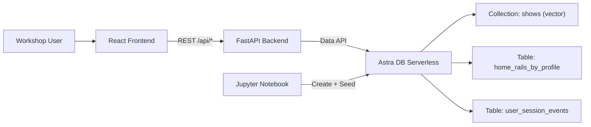
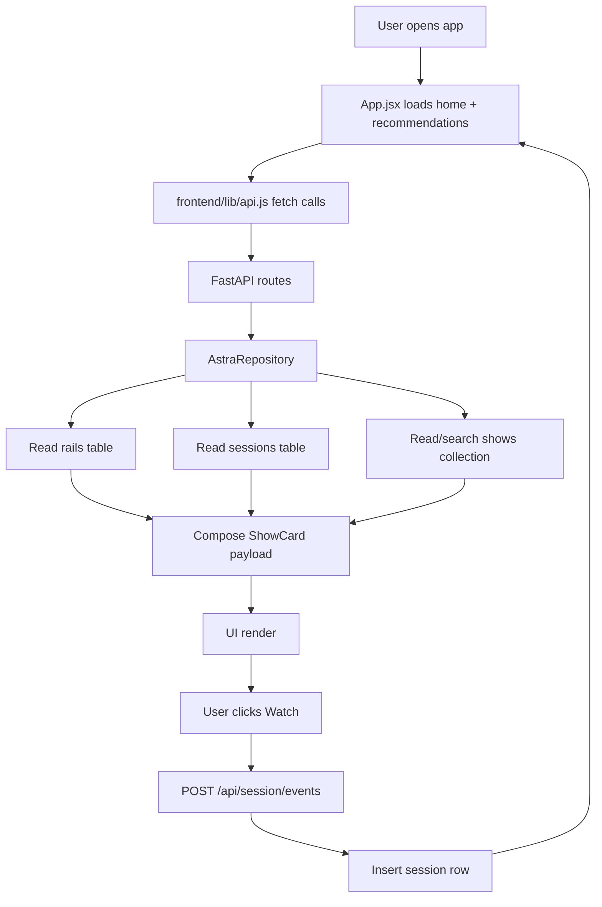
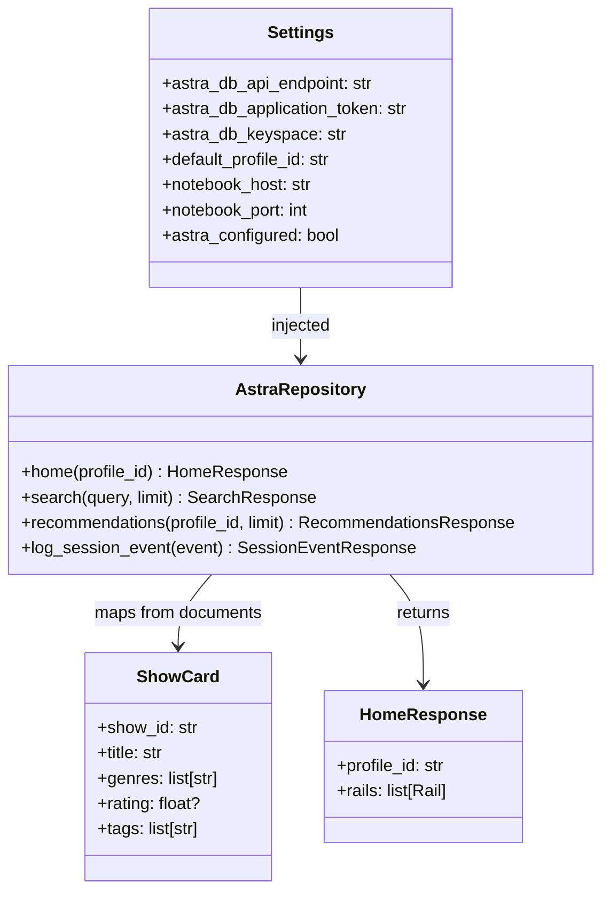
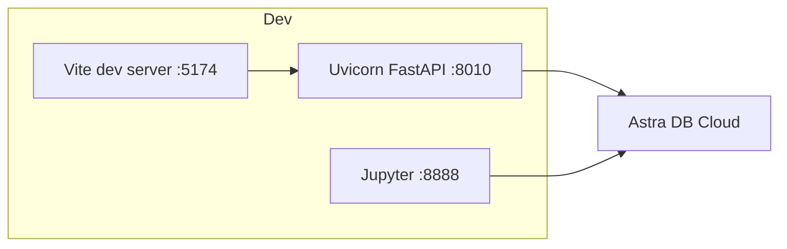
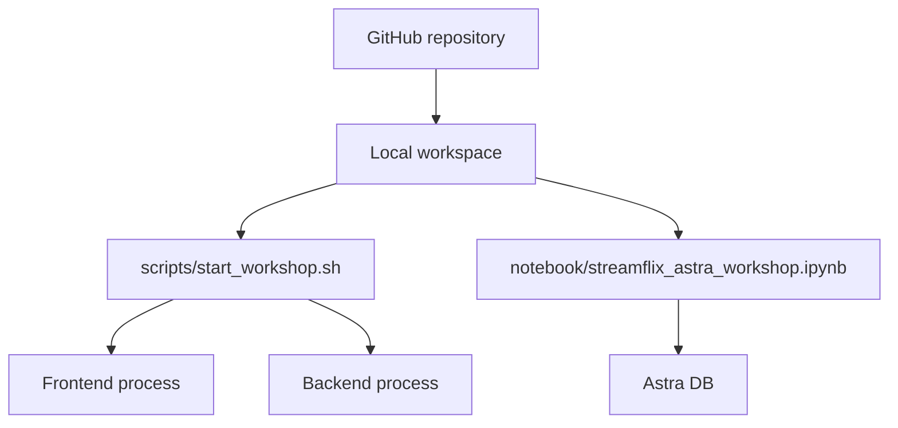

# CodebaseDetails.md

## 1. The Big Picture (Project Overview)

### Executive summary (simple first)
This project is **StreamFlix**, a workshop app that looks like a mini Netflix homepage but is really a teaching tool for Astra DB. In one session, users can provision a database, load realistic TV data through a notebook, and immediately explore search and personalization in a web UI. It is built to demonstrate two data styles together: structured table reads (for homepage rails and session history) and vector search (for “find shows by meaning”). If you’re a founder or product owner, think of it as a live product demo + training lab bundled into one repo.

### Deeper dive
- **Problem solved:** Teaching NoSQL + vector concepts is usually abstract and slow; this project makes it concrete in ~60 minutes.
- **Who it solves it for:** workshop instructors, technical teams evaluating Astra DB, and decision-makers who need a visible end-to-end demo.
- **Stage:** This is best described as a **workshop MVP / demo-first v1**, optimized for clarity and reliability over enterprise complexity.

### User journey in plain words
1. User creates an Astra DB instance and gets endpoint + token.
2. User opens the notebook and runs cells to create schema and seed data.
3. User starts backend and frontend locally.
4. User browses rails, runs semantic search, clicks a show, and sees “continue watching” update.

---

## 2. Technical Architecture — The Blueprint

### Simple version
You have three moving parts:
- **Frontend (React):** what users see and click.
- **Backend (FastAPI):** traffic controller and business logic.
- **Astra DB:** where the data lives (tables + vectorized collection).

### Text architecture diagram

```text
[User Browser]
     |
     | HTTP
     v
[React Frontend]
     |
     | /api/home, /api/search, /api/recommendations, /api/session/events
     v
[FastAPI Backend]
     |
     | Astra Data API (astrapy)
     v
[Astra DB Serverless]
  |-------------------------------|
  | Collection: shows (vector)    |
  | Table: home_rails_by_profile  |
  | Table: user_session_events    |
  |-------------------------------|

[Workshop Notebook] ---> creates schema + seeds data ---> [Astra DB]
```

### Building tour (restaurant analogy)
Think of the system as a restaurant built for training new staff.

- **Front desk (frontend):** takes customer requests (search, click, watch).
  - File: [frontend/src/App.jsx](frontend/src/App.jsx)
- **Kitchen manager (backend API):** receives requests, decides what data to fetch/write.
  - File: [backend/app/main.py](backend/app/main.py)
- **Kitchen stations (repository):** specific routines for home rails, search, recommendations, and session writes.
  - File: [backend/app/repository.py](backend/app/repository.py)
- **Pantry shelves (Astra tables):** neat bins for predictable records.
- **Chef’s intuition board (vector collection):** finds “similar” items by meaning, not exact text.
- **Training manual (notebook):** sets up the pantry before service starts.
  - File: [notebook/streamflix_astra_workshop.ipynb](notebook/streamflix_astra_workshop.ipynb)

### Why these choices (and not the obvious alternatives)

1. **FastAPI instead of a heavier full-stack framework**
- Why: quick to build/read, perfect for workshop speed, automatic API docs.
- Alternative: Django/Flask with more boilerplate.
- Trade-off: fewer built-in enterprise guardrails unless added intentionally.

2. **Astra tables + collection together**
- Why: this repo’s teaching goal is hybrid data access.
- Alternative: only SQL-like table model, or only document/vector model.
- Trade-off: slightly more complexity, but much stronger demonstration value.

3. **Notebook-led ingestion instead of hidden scripts only**
- Why: participants can *see* each setup step and validate outputs.
- Alternative: one black-box seed command.
- Trade-off: notebook environment setup can trip up first-time users.

4. **Pre-enriched local snapshot instead of live metadata at runtime**
- Why: workshop reliability and predictable demo outcomes.
- Alternative: call TV APIs in real-time while users interact.
- Trade-off: data freshness depends on periodic offline refresh.

### Clever / unusual choices
- Backend notebook launcher can discover running Jupyter root/token and open the exact workshop notebook path ([backend/app/main.py](backend/app/main.py)).
- Recommendation “intent text” is built from recent watch history metadata and fed into vector search, which is a practical retrieval trick ([backend/app/repository.py](backend/app/repository.py)).
- Notebook validation avoids table full scans by using partition-key reads (performance-conscious teaching choice).

---

## 3. Codebase Structure — The Filing System

### Simple version
- `frontend/` = screens and interactions.
- `backend/` = APIs and data logic.
- `data/` = sample content.
- `notebook/` = setup walkthrough.
- `scripts/` = automation helpers.

### Folder tree (top 2–3 levels)

```text
.
├── README.md
├── QUICKSTART.md
├── WORKSHOP.md
├── .env.example
├── .devcontainer/devcontainer.json
├── backend/
│   ├── app/
│   │   ├── main.py
│   │   ├── repository.py
│   │   ├── models.py
│   │   └── config.py
│   └── tests/test_app.py
├── frontend/
│   ├── package.json
│   ├── vite.config.js
│   ├── src/
│   │   ├── App.jsx
│   │   ├── lib/api.js
│   │   └── components/
│   └── tests/e2e/smoke.spec.js
├── data/
│   ├── tv_shows_300.json
│   └── seed_profiles.json
├── notebook/
│   └── streamflix_astra_workshop.ipynb
└── scripts/
    ├── start_workshop.sh
    ├── fetch_tvmaze_snapshot.py
    └── generate_seed_profiles.py
```

### Folder-by-folder guide

#### `backend/`
- **What lives here:** API routes, contracts, and Astra data access.
- **Open this when:** API errors, data mismatch, or recommendation behavior looks wrong.
- **Connection to others:** frontend sends requests here; notebook creates the data this code expects.

#### `frontend/`
- **What lives here:** all user-facing UI, API client code, styling, browser tests.
- **Open this when:** layout/interaction issues, failed fetch calls, admin menu behavior.
- **Connection to others:** consumes backend response contracts.

#### `data/`
- **What lives here:** prebuilt show docs and seeded profile events.
- **Open this when:** improving metadata quality or workshop demo variety.
- **Connection to others:** notebook ingests these into Astra; backend reads the ingested results.

#### `notebook/`
- **What lives here:** tutorial notebook with create/seed/validate flow.
- **Open this when:** environment setup or schema creation fails.
- **Connection to others:** acts as the bootstrap step for backend runtime success.

#### `scripts/`
- **What lives here:** shell/python automation for startup and data generation.
- **Open this when:** you want one-command startup or need a fresh dataset.
- **Connection to others:** feeds `data/` and starts frontend/backend process pair.

### Non-obvious naming conventions
- `home_rails_by_profile` and `user_session_events` are intentionally descriptive “teaching names.”
- `ShowCard` is the shared response shape across home/search/recommendations.
- `DEFAULT_PROFILE_ID` is used instead of login-based identity (workshop simplification).

### Entry points (where things start)
- Backend: [backend/app/main.py](backend/app/main.py)
- Frontend: [frontend/src/main.jsx](frontend/src/main.jsx)
- Data setup: [notebook/streamflix_astra_workshop.ipynb](notebook/streamflix_astra_workshop.ipynb)
- Local startup script: [scripts/start_workshop.sh](scripts/start_workshop.sh)

---

## 4. Connections & Data Flow — How Things Talk to Each Other

### Action 1: “User opens homepage”

1. User lands on frontend.
2. `App.jsx` triggers `loadHome()` and `loadRecommendations()`.
3. `frontend/src/lib/api.js` calls backend `/api/home` and `/api/recommendations`.
4. Backend route handlers in [backend/app/main.py](backend/app/main.py) call repository methods.
5. Repository reads rails/session tables and hydrates show details from collection.
6. Frontend renders rows via [frontend/src/components/RailRow.jsx](frontend/src/components/RailRow.jsx).

**What could go wrong:**
- If Astra env vars are missing, backend returns 503.
- If notebook wasn’t run, required schema/data may not exist.

### Action 2: “User types a semantic query”

1. User types in `SearchPanel` input ([frontend/src/components/SearchPanel.jsx](frontend/src/components/SearchPanel.jsx)).
2. App waits ~320ms and sends `/api/search?q=...`.
3. Backend calls `repository.search(query)`.
4. Repository performs vector query on `shows` collection using `$vectorize`.
5. Results return with optional similarity scores.
6. UI auto-selects first result, and click-select updates featured details.

**What could go wrong:**
- Missing collection or vector configuration => search fails.
- Metadata/vector text quality impacts relevance even when system is “working.”

### Action 3: “User clicks Watch/Resume”

1. Click event triggers `handleWatch(show)` in [frontend/src/App.jsx](frontend/src/App.jsx).
2. Frontend posts JSON to `/api/session/events`.
3. Backend validates payload shape with `SessionEventRequest` model.
4. Repository inserts event into `user_session_events` table.
5. Frontend refreshes home/recommendations so continue-watching updates.

**What could go wrong:**
- Session write failure => visible error banner.
- Bad/negative progress values can degrade continue-watching quality.

### External services and failure behavior
- **Astra DB Data API (runtime critical):** if unavailable, app endpoints return failures (503/502).
- **TVMaze API (offline script):** snapshot generation can degrade or fail if API/network errors occur.
- **TMDB API (offline enrichment):** improves metadata; missing key means reduced enrichment quality.
- **Jupyter server (admin helper):** backend route tries to open notebook; root/token mismatches can trigger explicit errors.

### Authentication flow
There is currently **no end-user authentication flow**. The app behaves as a demo profile (`DEFAULT_PROFILE_ID`) rather than a logged-in identity. That keeps workshops simple, but means there is no user-level authorization model yet.

---

## 5. Technology Choices — The Toolbox

| Technology | What It Does Here | Why This One | Watch Out For |
|-----------|------------------|-------------|---------------|
| **FastAPI** | Creates backend endpoints and response contracts quickly | Great speed/readability for workshop goals; built-in OpenAPI docs | No built-in auth strategy used in this repo yet. Free/open-source. |
| **Uvicorn** | Runs the backend server | Standard lightweight ASGI runtime for FastAPI | Needs process management if deployed beyond local dev. Free. |
| **Astra DB Serverless** | Stores rails/events + vectorized show docs | Single platform for table-like and vector use cases (perfect for teaching hybrid NoSQL) | Usage-based cloud cost; schema/region choices matter. |
| **astrapy** | Python SDK to call Astra Data API | Unified way to read/write both tables and collections | Table and collection command sets are not identical; easy to misuse. |
| **React** | Builds interactive frontend UI | Component model keeps feature UI modular and fast to iterate | State complexity grows as features grow. Free. |
| **Vite** | Frontend dev/build tool | Very fast local startup and hot reload | Port drift can create confusing local behavior. Free. |
| **Pydantic** | Defines/validates API payload shapes | Keeps backend contracts explicit and safer | Validation strictness depends on model constraints you add. Free. |
| **JupyterLab** | Step-by-step workshop setup and validation experience | Great for educational transparency and demos | Environment setup is a common friction point. Free. |
| **Playwright** | Browser-level smoke testing | Verifies UI + API contract behavior end to end | Needs stable mocks and local browser dependencies. Free tool, CI runtime costs if automated. |
| **TVMaze API** | Base source for show metadata/images (offline generation) | Rich TV dataset suitable for demos | External rate limits/availability/terms. |
| **TMDB API (optional)** | Enriches creators/directors/tags/network metadata offline | Improves data completeness for richer UI and search | Requires API key; matching logic can produce gaps/false matches. |
| **Devcontainer** | Reproducible dev environment in Codespaces | Lowers setup friction for workshop participants | Cloud IDE minutes/resources may have cost limits. |

---

## 6. Environment & Configuration

### Simple version
The project is controlled by `.env` values. If a value is wrong, the app usually can’t connect to Astra or the frontend can’t talk to backend.

### Main environment variables and what they control
Template file: [.env.example](.env.example)

- `ASTRA_DB_API_ENDPOINT`: Astra database URL.
- `ASTRA_DB_APPLICATION_TOKEN`: secret key for Astra API access.
- `ASTRA_DB_KEYSPACE`: logical workspace inside Astra.
- `DEFAULT_PROFILE_ID`: default demo profile identity.
- `ASTRA_VECTOR_PROVIDER`, `ASTRA_VECTOR_MODEL`: vector setup assumptions.
- `BACKEND_PORT`, `FRONTEND_PORT`: local runtime ports.
- `CORS_ORIGINS`: which frontend origins backend accepts.
- `VITE_API_BASE_URL`: frontend -> backend target URL.
- `VITE_DEFAULT_PROFILE_ID`: frontend default profile fallback.
- `VITE_ASTRA_PORTAL_URL`, `VITE_GITHUB_REPO_URL`: admin menu links.
- `NOTEBOOK_HOST`, `NOTEBOOK_PORT`: backend notebook launcher target.
- `TMDB_API_KEY` / `TMDB_BEARER_TOKEN`: optional offline enrichment credentials.

### Environment model (dev/staging/prod)
- Explicitly documented and implemented environment is **local development/workshop**.
- No dedicated staging/production config sets are present in repo.
- In practice, environment switching is currently “change `.env` and restart services.”

### Change guidance (plain language)
- Want a different frontend port?
  - Update `FRONTEND_PORT` and `CORS_ORIGINS` together.
  - Be careful: if one changes without the other, browser requests can fail.

- Want a new Astra keyspace?
  - Update `ASTRA_DB_KEYSPACE`.
  - Rerun notebook schema creation in that keyspace.
  - Be careful: backend expects tables/collection to already exist there.

### Secrets/keys and service mapping
- Astra token -> Astra DB runtime access.
- TMDB keys -> offline dataset enrichment only.
- `.env` is gitignored, so secrets are not committed by default.

---

## 7. Quick Reference Card

### Run locally (zero-to-running)

1. Copy env template and fill Astra credentials.
```bash
cp .env.example .env
```

2. Create Python env and install backend deps + Jupyter.
```bash
python3 -m venv .venv
source .venv/bin/activate
python3 -m pip install -r backend/requirements.txt jupyterlab
```

3. Install frontend deps.
```bash
cd frontend
npm install
cd ..
```

4. Launch notebook in env-loaded shell and run all cells.
```bash
source .venv/bin/activate
set -a
source .env
set +a
jupyter lab notebook/streamflix_astra_workshop.ipynb
```

5. Start app stack.
```bash
./scripts/start_workshop.sh
```

### Key URLs
- Frontend: `http://localhost:5174` (or your configured `FRONTEND_PORT`)
- Backend health: `http://localhost:8010/health`
- Backend API docs: `http://localhost:8010/docs`
- Astra portal: `https://astra.datastax.com/`
- GitHub repo (default env link): `https://github.com/tlsandbox/streamflix-astradb`

### Who/where to go when something breaks
- First stop: [QUICKSTART.md](QUICKSTART.md) and [README.md](README.md).
- Next: verify notebook ran successfully and schema exists in Astra.
- Then: check backend health route and browser console network errors.
- Organizational owner is not explicitly documented in repo; operationally this is usually the workshop facilitator/product owner.

### Most commonly used commands
```bash
# Start all
./scripts/start_workshop.sh

# Backend only
source .venv/bin/activate
set -a && source .env && set +a
python3 -m uvicorn backend.app.main:app --reload --host 0.0.0.0 --port 8010

# Backend tests
cd backend
python3 -m pytest -q

# Frontend E2E tests
cd frontend
npm run test:e2e
```

---

## 8. Dependencies and Integrations

### 8.0 Dependencies (main libraries/frameworks)

#### Backend
- `fastapi` — HTTP API framework.
  - Config: [backend/requirements.txt](backend/requirements.txt)
  - Usage: [backend/app/main.py](backend/app/main.py)
- `astrapy` — Astra Data API SDK.
  - Usage: [backend/app/repository.py](backend/app/repository.py)
- `pydantic` — request/response schema models.
  - Usage: [backend/app/models.py](backend/app/models.py)
- `uvicorn` — app server runtime.
  - Startup usage: [scripts/start_workshop.sh](scripts/start_workshop.sh)

#### Frontend
- `react`, `react-dom` — UI rendering.
  - Config: [frontend/package.json](frontend/package.json)
- `vite` + `@vitejs/plugin-react` — dev/build tooling.
  - Config: [frontend/vite.config.js](frontend/vite.config.js)
- `@playwright/test` — browser smoke tests.
  - Usage: [frontend/tests/e2e/smoke.spec.js](frontend/tests/e2e/smoke.spec.js)

### 8.0 Integrations (external systems)
- **Astra DB Serverless**
  - Core runtime data store and vector search service.
  - Communication: backend and notebook call Astra Data API over HTTPS.
  - Code points: [backend/app/repository.py](backend/app/repository.py), [notebook/streamflix_astra_workshop.ipynb](notebook/streamflix_astra_workshop.ipynb)

- **TVMaze API**
  - Offline dataset source for show metadata/images.
  - Communication: Python script HTTP requests.
  - Code points: [scripts/fetch_tvmaze_snapshot.py](scripts/fetch_tvmaze_snapshot.py)

- **TMDB API (optional)**
  - Offline enrichment for credits/tags/network details.
  - Communication: Python script HTTP requests with API key/bearer token.
  - Code points: [scripts/fetch_tvmaze_snapshot.py](scripts/fetch_tvmaze_snapshot.py)

- **Jupyter server integration**
  - Backend can launch/discover notebook server for workshop convenience.
  - Code points: [backend/app/main.py](backend/app/main.py)

### 8.1 API Documentation (if applicable)
- Evidence of API framework with OpenAPI support exists via FastAPI app definition.
- Runtime docs are generally available at:
  - `/docs` (Swagger UI)
  - `/openapi.json`
- No standalone OpenAPI file is committed in the repo.

---

## 9. Diagrams

### 9.1 Component diagram



### 9.2 Data flow diagram



### 9.3 Class diagram (backend core)



### 9.4 Simplified deployment diagram



### 9.5 Simplified infrastructure/deployment diagram



---

## 10. Testing

### Simple version
Yes, there are automated tests for backend API contracts and frontend smoke behavior.

### Test types found
- **Backend tests** (contract-style unit tests with fake repository):
  - [backend/tests/test_app.py](backend/tests/test_app.py)
- **Frontend E2E smoke test** (Playwright with mocked API routes):
  - [frontend/tests/e2e/smoke.spec.js](frontend/tests/e2e/smoke.spec.js)

### Frameworks used
- Backend: `pytest`, `fastapi.testclient`
- Frontend: `@playwright/test`

### How tests are typically executed
- Backend:
```bash
cd backend
python3 -m pytest -q
```
- Frontend E2E:
```bash
cd frontend
npm run test:e2e
```

### Local test run notes
- Playwright config auto-starts a local Vite server for tests ([frontend/playwright.config.js](frontend/playwright.config.js)).
- Backend tests use dependency override with `FakeRepository`, so they test endpoint contracts more than real Astra integration.

### CI/CD strategy evidence
- No CI pipeline files (e.g., `.github/workflows`) are present in tracked files.
- Current testing appears manually triggered in local/dev workflows.

