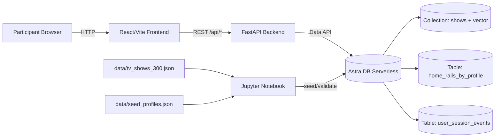

# StreamFlix Astra DB Workshop

StreamFlix is a Netflix-inspired workshop app for Astra DB Serverless that demonstrates:

- vector search with Astra collections
- personalized rails with Astra tables
- session/progress writes for “Continue Watching”

It is designed for a 60-minute hands-on flow where participants provision Astra, load data with a notebook, and run a full React + FastAPI demo.

## Architecture



## Project Layout

- `frontend/` React + Vite UI
- `backend/` FastAPI API and Astra Data API integration
- `notebook/streamflix_astra_workshop.ipynb` ingestion and validation tutorial
- `data/` pre-enriched show snapshot and profile fixtures
- `scripts/` data generation and local startup helpers
- `WORKSHOP.md` 60-minute instructor agenda
- `QUICKSTART.md` command-first setup guide

## Quick Start

Use the exact commands in [QUICKSTART.md](./QUICKSTART.md).

Key point for notebook users: start Jupyter from a shell that has already loaded `.env`.

## Workshop Runbook

- Instructor timeline: [WORKSHOP.md](./WORKSHOP.md)
- Core workshop phases:
  - 0-15 min Astra provisioning/token
  - 15-35 min notebook ingest
  - 35-55 min app exploration
  - 55-60 min recap

## Maintainer: Refresh Snapshot (TVMaze + TMDB, offline)

Runtime app does not call TMDB. TMDB is used only when rebuilding the local snapshot.

```bash
export TMDB_API_KEY=<your_tmdb_key>
python3 scripts/fetch_tvmaze_snapshot.py
```

The script now:

- merges TVMaze + TMDB metadata with creator-first / director fallback policy
- retries transient failures and handles API throttling backoff
- prints metadata fill-rate coverage after generation

## API Endpoints

- `GET /health`
- `GET /api/home?profile_id=...`
- `GET /api/search?q=...`
- `GET /api/recommendations?profile_id=...`
- `POST /api/session/events`

## Tests

Backend:

```bash
cd backend
python3 -m pytest -q
```

Frontend smoke (Playwright):

```bash
cd frontend
npm run test:e2e
```

## Attribution

- TV metadata and images source: [TVMaze API](https://www.tvmaze.com/api)
- Optional enrichment source for offline snapshot generation: [TMDB API](https://developer.themoviedb.org/)
